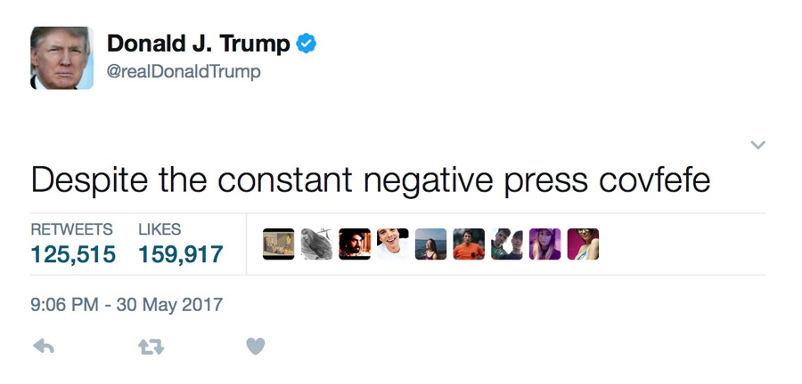

# covfefe-flow

covfefe-flow is a @realDonaldTrump :triumph: fake tweet generator 🤖.

[original (deleted) tweet](https://archive.is/f7UL3)

> Despite the constant negative press covfefe

## Get Tweets
:fast_forward: [Get Tweets](./get-tweets) - Get @realDonaldTrump tweets for training

## :running: Train
:fast_forward: [Train](./train) - Train the recurrent neural net (RNN)

## TensorFlow Serving
:fast_forward: [TensorFlow Serving](./tensorflow-serving) - Deploy and serve the RNN model

## :computer: API
:fast_forward: [API](./api) - JSON-API for fake tweet creation

## :iphone: Webapp
:fast_forward: [Webapp](./webapp) - Angular webapp for fake tweet creation

## :speech_balloon: Chatbot
- [ ] TODO

## :house: Architecture & :rocket: Deployment
:fast_forward: [Architecture & Deployment](./deployment) - Architecture and deployment scripts

## :art: Design
:fast_forward: [Design](./design) - Colors and logo