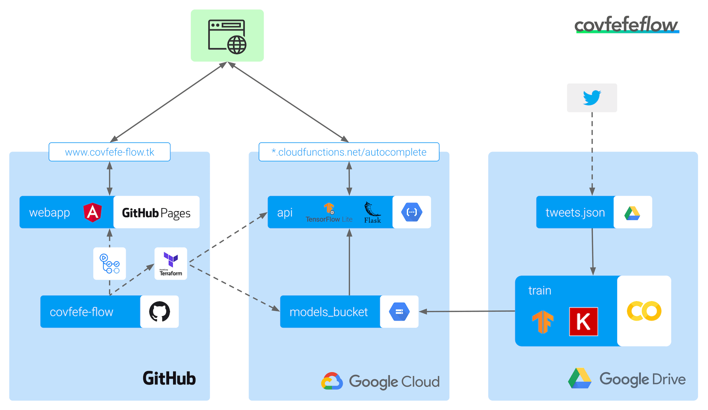

# covfefe-flow

*covfefe-flow* is a @realDonaldTrump :triumph: fake tweet autocompleter 🤖.

[original (deleted) tweet](https://archive.is/f7UL3)

> Despite the constant negative press covfefe

## Train

[Train](./train) - Train the recurrent neural net (RNN)

## API

[API](./api) - JSON-API for fake tweet autocompletion

## Webapp

[Webapp](./webapp) - Angular webapp for fake tweet autocompletion

## Architecture & Deployment

[Architecture & Deployment](./deployment) - Architecture and deployment scripts

## Design

[Design](./design) - Colors and logo
