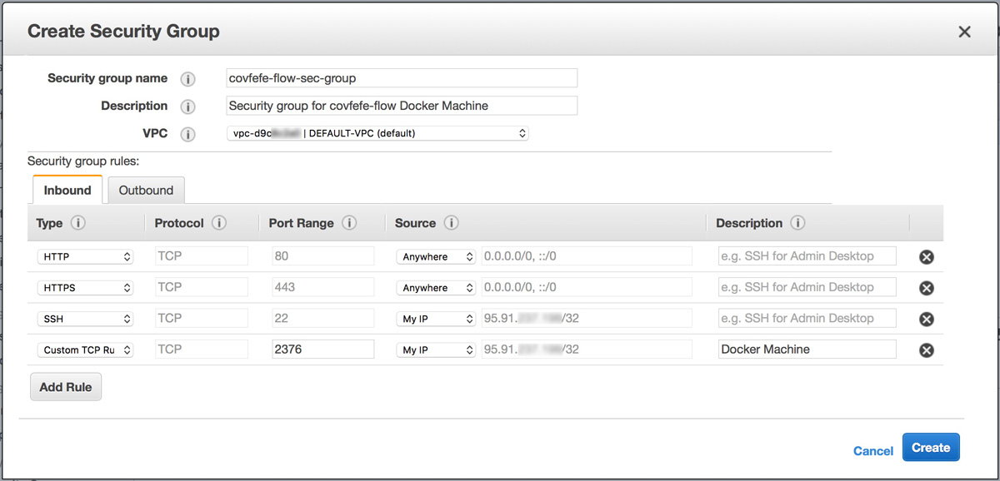
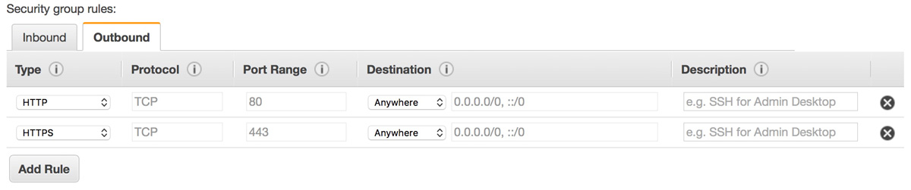

# :house: Architecture & :rocket: Deployment

## :house: Architecture

The architecture and interplay of components and (external) services is illustrated in the following image:

### Internal

#### :whale: [Docker](https://www.docker.com)

The individual components of the covfefe-flow application are containerized using [Docker](https://github.com/docker/docker-ce).
These containers are represented by the blue boxes in the above architecture illustration.
The following Docker features are used:
- [Docker volumes](https://docs.docker.com/engine/admin/volumes/volumes/) for persisting and sharing data between Docker containers. The Docker volumes are represented by the blue cylinders in the above architecture illustration.
- Docker [multi-stage builds](https://docs.docker.com/engine/userguide/eng-image/multistage-build/) for building and serving the Angular client app (see [webapp Dockerfile](../webapp/Dockerfile))
- [Docker Compose](https://github.com/docker/compose) for orchestrating the containers (see [docker-compose.yml](../docker-compose.yml))
- [Docker Machine](https://github.com/docker/machine) for provisioning to a remote Docker host on [AWS EC2](https://aws.amazon.com/de/ec2/)

#### [AWS EC2](https://aws.amazon.com/ec2)
The complete covfefe-flow app is running on an [AWS EC2](https://aws.amazon.com/ec2) `t2.micro` instance (see [AWS config file](./aws_config.txt)).
For provisioning the app to AWS EC2 the [`amazonec2` Docker Machine driver](https://docs.docker.com/machine/examples/aws/) is used (see [0_2_build_docker_machine_aws.sh](./0_2_build_docker_machine_aws.sh)).

##### Security Group `covfefe-flow-sec-group`
In the [AWS console](https://console.aws.amazon.com/ec2/v2/home?region=us-east-1#SecurityGroups) you need create a new Security Group with the name `covfefe-flow-sec-group` and the following rules:

**Inbound rules:**

- `HTTP` (port 80) and `HTTPS` (port 443) from anywhere
- `SSH` (port 22) from your IP
- `Docker machine` (port 2376) from your IP

**Outbound rules:**

- `HTTP` (port 80) and `HTTPS` (port 443) to anywhere

### External

#### [Let’s Encrypt](https://letsencrypt.org)
The SSL certificate used for covfefe-flow is issued by [Let’s Encrypt](https://letsencrypt.org) and thus free! It was generated using the official [certbot/certbot](https://hub.docker.com/r/certbot/certbot/) Docker image.

## :rocket: Deployment
...