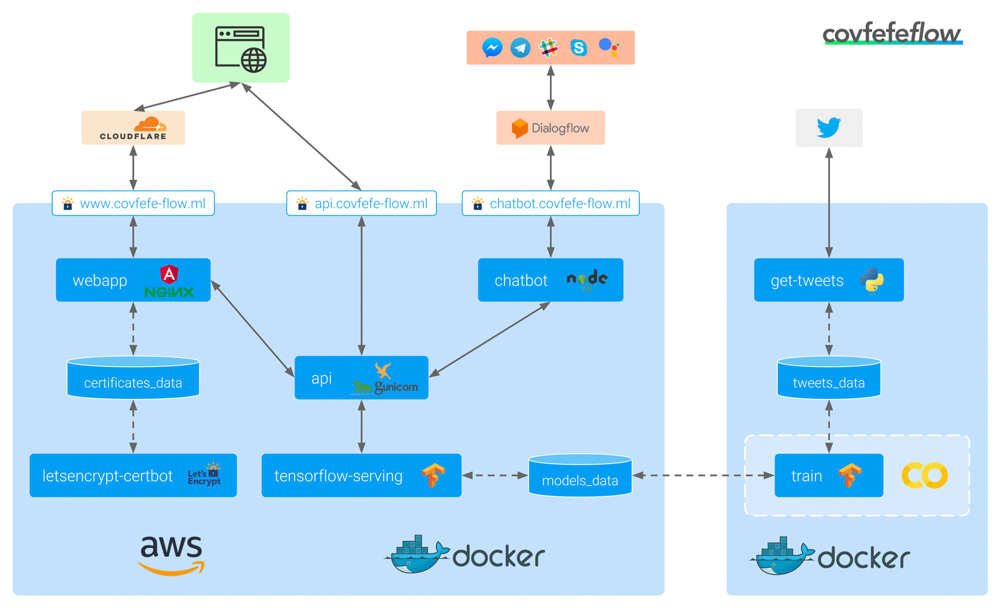

# :house: Architecture & :rocket: Deployment

## :house: Architecture

The architecture and interplay of components and (external) services is illustrated in the following image:

### Makefile

Use the [`Makefile`](../Makefile) to run common tasks. To see which commands are available run `make help`.
