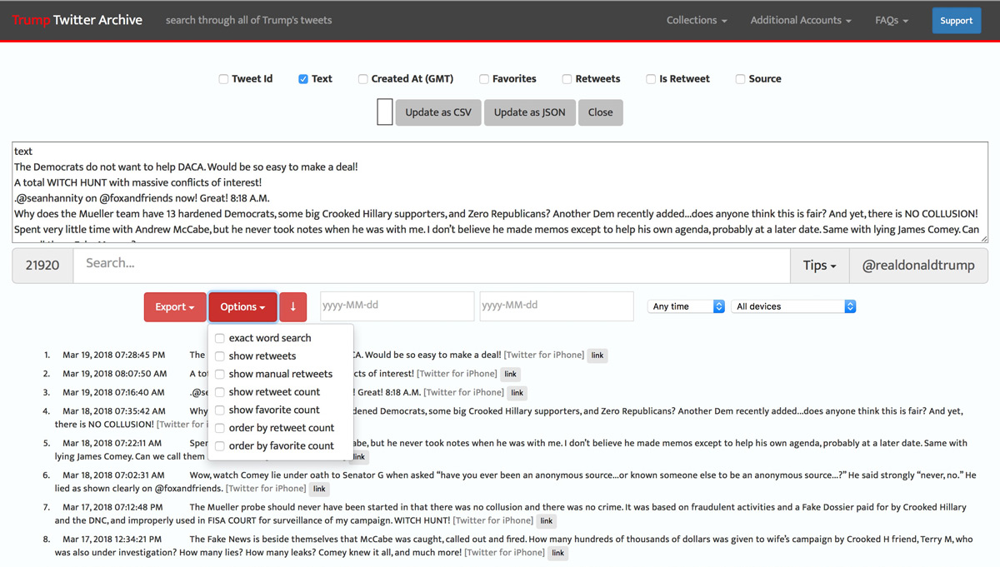

# GetTweets

Get [@realDonaldTrump](https://twitter.com/realdonaldtrump) Tweets for training the neural net.

## Possible sources:

### [Twitter API](https://developer.twitter.com/en/docs)
The [Twitter API](https://developer.twitter.com/en/docs) is a great way to get the most recent Tweets of user via the [statuses/user_timeline](https://developer.twitter.com/en/docs/tweets/timelines/api-reference/get-statuses-user_timeline.html) endpoint.
However, it can only return up to 3,200 of a user’s most recent Tweets.
Since @realDonaldTrump has more than 30,000 Tweets this method is not suitable :weary:.

### [trumptwitterarchive.com](http://www.trumptwitterarchive.com/archive)

[trumptwitterarchive.com](http://www.trumptwitterarchive.com/archive) lets you download a list of *all* tweets from @realDonaldTrump as CSV.
Since we don't need any metadata like `Tweet id`, `timestamp`, `#favorites`, `#retweets` you should only export the pure `Text` without the `,` separator.
The archive also contains `retweets` and `manual retweets`. As they do not reflect @realDonaldTrump's style of writing, you should also filter out these Tweets via `Options`.
